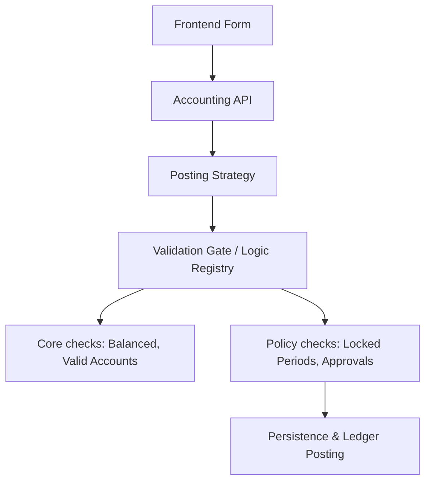

# Final Accounting Architecture & Roadmap

This document outlines the finalized architecture for the Accounting Core and the implementation roadmap to align the system with the "Simple by default, Strict when needed" vision.

## 1. Core Principles (Non-negotiable)

- **Single Source of Truth**: All financial impact lives ONLY in balanced journal entries (`VoucherEntity` V2). Documents (Invoices, Vouchers) are mere "posting sources."
- **Immutable Invariants**: Vouchers must be balanced in base currency at all times.
- **Backend Authority**: Final validation and policy enforcement happen exclusively in the backend.
- **Core vs. Features**:
  - **Core**: Journal creation, Posting logic, Balance enforcement, Base currency handling.
  - **Features (Pluggable)**: Approval workflows, Period locking, Cost centers, Account access scopes.

## 2. Architecture: The Validation Gate

To support flexible strictness, we implement a **Single Validation Gate**:

## 3. Implementation Roadmap

### Phase 1: Core Consolidation (High Priority)
- [ ] **Standardize Strategies**: Update all `IVoucherPostingStrategy` implementations to return `VoucherLineEntity` (V2).
- [ ] **Refactor Use Cases**: Align `VoucherUseCases.ts` to fully leverage ADR-005 entities.
- [ ] **Uniform Ledger Posting**: Ensure `FirestoreLedgerRepository` only accepts `VoucherEntity` V2.

### Phase 2: The Logic Gate & Policy Engine
- [ ] **Create Validation Service**: Centralize all accounting invariants in a dedicated service.
- [ ] **Implement Policy Hooks**: Create extension points for "Before Posting" and "After Posting" logic.
- [ ] **Static Policy Registry**: Implement modules for `PeriodLockPolicy` and `StrictApprovalPolicy`.

### Phase 3: Cleanup & Verification
- [ ] **Ditch Legacy Entities**: Remove old `Voucher` and `VoucherLine` classes once migration is complete.
- [ ] **Bulletproof Testing**: Verify edge cases like multi-currency rounding and cross-company separation.

## 4. What to Read Next
- **Plan**: [Implementation Plan](file:///C:/Users/mahmu/.gemini/antigravity/brain/ea6d4e25-ee2e-4316-aece-cb01ffd9b397/implementation_plan.md)
- **Entities**: [VoucherEntity.ts](file:///c:/Users/mahmu/OneDrive/Desktop/ERP03-github/ERP03/backend/src/domain/accounting/entities/VoucherEntity.ts)
- **Repository**: [FirestoreLedgerRepository.ts](file:///c:/Users/mahmu/OneDrive/Desktop/ERP03-github/ERP03/backend/src/infrastructure/firestore/repositories/accounting/FirestoreLedgerRepository.ts)
